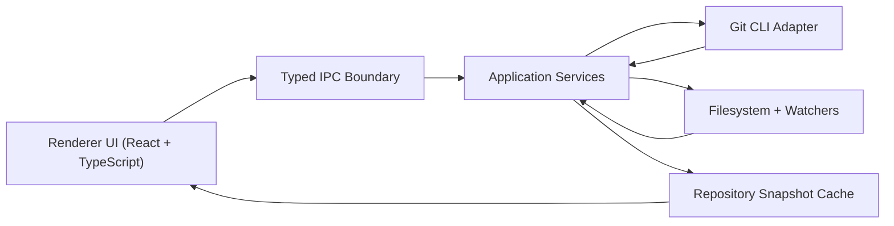

# Architecture

## Goal

Build a SmartGit-style desktop Git client that runs on Windows and Linux, starts with a narrow feature set, and is simple enough that AI agents can extend it safely.

Phase 1 scope:

- Open a local repository.
- Render a repository file tree.
- Show local and remote branches.
- Push and pull.
- Render diffs from native `git diff` output.

Out of scope for Phase 1:

- Commit authoring UI.
- Interactive staging.
- Merge conflict resolution UI.
- Rebase, cherry-pick, stash, tags, submodule management, and worktree management.
- Embedded credential storage.

## Stack Decision

Recommended stack:

- Desktop runtime: Electron
- Language everywhere: TypeScript
- UI: React + Vite
- State management: Zustand
- Validation: Zod
- Testing: Vitest, Playwright
- Packaging: Electron Forge

Why this stack:

- TypeScript across main process, renderer, shared contracts, and tests keeps the system single-language.
- Electron is the most mature cross-platform desktop shell for Windows and Linux.
- Native Git integration is easier through the system `git` CLI than through libgit2 wrappers or reimplemented Git libraries.
- The ecosystem is broad, predictable, and easy for AI agents to work in.

Rejected alternatives:

- Tauri: smaller runtime, but adds Rust and a dual-language development model too early.
- PySide/PyQt: viable, but desktop packaging and long-term UI iteration are typically slower with AI-assisted workflows.
- NodeGit/libgit2: increases integration risk and diverges from actual CLI behavior users already trust.

## Stack Comparison: Electron + TypeScript vs Tauri + Rust

This project could be built with either stack. For this repo, Electron + TypeScript is the better first choice.

### Electron + TypeScript

Strengths:

- One primary language across desktop shell, UI, shared contracts, and tests.
- Faster iteration for AI-assisted development.
- Mature ecosystem for desktop tooling, IPC patterns, and packaging.
- Lower upfront architectural cost for a Git client whose first version is mostly UI plus process orchestration.
- Easier hiring, maintenance, and onboarding for a broad contributor base.

Weaknesses:

- Higher memory footprint than a Rust-backed desktop shell.
- Weaker compile-time guarantees than Rust.
- More care needed around process boundaries and runtime validation.

### Tauri + Rust

Strengths:

- Smaller runtime footprint.
- Stronger backend safety guarantees.
- Better fit if the app later grows into a heavy local-services architecture.
- Good long-term option for performance-sensitive indexing, background analysis, or advanced repository operations.

Weaknesses for this repo right now:

- Introduces a dual-language architecture immediately.
- Raises the cost of every cross-boundary change between UI and backend.
- Slows down early-phase delivery when the biggest problems are workflow design, Git correctness, and UX, not backend throughput.
- Makes AI-assisted development less efficient because changes often span Rust, TypeScript, and interop contracts.

### Decision

Choose Electron + TypeScript for Phase 1.

Revisit Tauri + Rust only if one or more of these becomes true:

- memory footprint becomes a product-level problem
- startup time becomes a major competitive issue
- repository analysis grows into a sustained CPU-heavy backend workload
- the team explicitly wants to invest in a Rust-first architecture

## Product Principles

1. Git is the source of truth. Do not reimplement Git behavior.
2. The app should prefer safe operations and explicit user intent over convenience.
3. If structured parsing fails, the app must still show raw Git output rather than hide information.
4. Authentication should flow through the user's existing SSH agent and Git credential helpers.
5. Read operations should be cheap, cancellable, and isolated from write operations.
6. The interface must feel modern, deliberate, and high quality rather than purely utilitarian.
7. The MVP requires system Git and must report clearly when Git is not installed.

## High-Level Design



## Main Modules

### 1. Renderer UI

Responsibilities:

- Repository picker and recent repositories.
- Repository switching within the same window.
- File tree panel.
- Branch panel.
- Diff panel.
- Operation feedback: loading, progress, errors, raw output fallback.
- Modern, visually coherent desktop interaction model.

Rules:

- Renderer never shells out to Git directly.
- Renderer talks only through typed IPC contracts.
- Long-running operations must expose cancellation and progress states.
- Visual polish must not hide repository truth or error details.

### 2. Main Process Application Services

Responsibilities:

- Coordinate Git operations.
- Maintain repository sessions.
- Serialize write operations per repository.
- Publish snapshot updates to the renderer.

Core services:

- `RepositoryRegistry`
- `RepositorySession`
- `OperationQueue`
- `SnapshotBuilder`
- `DiffService`
- `BranchService`
- `SyncService`
- `GitExecutableResolver`

### 3. Git CLI Adapter

Responsibilities:

- Discover the correct `git` executable.
- Execute Git with explicit arguments and timeouts.
- Capture stdout, stderr, exit code, and duration.
- Normalize process execution across Windows and Linux.

Rules:

- Prefer `spawn` without shell wrapping.
- Pass argument arrays, never string-concatenated commands.
- Disable pagers and external diff tooling for app-managed commands.
- Always capture raw output for logging and fallback UI.

Recommended command defaults:

- `GIT_PAGER=cat`
- `TERM=dumb`
- `LC_ALL=C`

On Windows, preserve normal path handling and avoid custom path rewriting unless Git explicitly requires it.

### 4. Repository Snapshot Cache

Purpose:

Keep a current in-memory view of repository state so the UI does not rebuild everything on every click.

Snapshot sections:

- Repository identity: root path, current HEAD, detached state.
- Branches: local, remote-tracking, upstream relations, ahead/behind counts.
- Working tree tree nodes: tracked, modified, deleted, renamed, untracked, ignored.
- Diff summaries per selected file.
- Operation state: idle, reading, writing, error.

Cache policy:

- Read-through rebuild on open.
- Incremental refresh after commands complete.
- Debounced filesystem-triggered refresh.
- Hard refresh available when watchers are noisy or stale.

### 5. Filesystem Watchers

Watch:

- `.git/HEAD`
- `.git/index`
- `.git/refs`
- working tree directories

Rules:

- Debounce change bursts.
- Treat watcher signals as hints, not truth.
- Re-read repository state through Git commands after a watcher fires.

## Data Flow By Feature

### Repository Tree

Primary commands:

- `git status --porcelain=v2 -z --branch`
- `git ls-files -z`
- `git ls-files --others --exclude-standard -z`
- `git check-ignore -z --stdin` when needed for edge cases

Strategy:

- Build the tree from Git-visible files, not only from raw filesystem walks.
- Merge tracked and untracked results into one virtual tree.
- Represent directories virtually so large repositories do not require eager expansion.

Why:

- Pure filesystem walking misses Git state.
- Pure `git status` misses unchanged tracked files.
- The merged approach gives a complete tree with correct status overlays.

### Branches

Primary commands:

- `git branch --show-current`
- `git for-each-ref --format=... refs/heads refs/remotes`
- `git status --porcelain=v2 --branch`

Data captured:

- Local branches
- Remote-tracking branches
- Current branch or detached HEAD
- Upstream tracking
- Ahead/behind counts
- Default remote when inferable

Important branch states:

- Detached HEAD
- Unborn branch
- Missing upstream
- Gone upstream branch
- Diverged branch

### Pull

Phase 1 command:

- `git pull --ff-only`

Why:

- Avoids silent merge commits.
- Keeps first implementation simple.
- Forces explicit future work for merge and rebase UX.

Handling:

- If fast-forward is impossible, show Git's raw explanation and recommended next action.
- Surface authentication and network failures directly.

### Push

Phase 1 commands:

- `git push`
- `git push --set-upstream <remote> <branch>` when no upstream exists

Handling:

- Detect missing upstream before push.
- Present remote rejection reasons exactly as Git reports them.
- Do not hide hook failures.

### Diff View

Primary commands:

- `git diff --no-ext-diff --submodule=short --find-renames --find-copies`
- `git diff --cached --no-ext-diff --submodule=short --find-renames --find-copies`
- `git diff <base>...<target> --no-ext-diff --submodule=short --find-renames --find-copies` for branch comparisons later

Rendering model:

- Parse unified diff output into file sections, hunks, and lines.
- Preserve raw diff text alongside structured parse results.
- If a file is binary or parsing fails, fall back to raw text or a binary marker.

Important cases:

- Renames and copies
- Mode changes
- New and deleted files
- Binary files
- Large diffs
- No newline at end of file markers

Parser strategy:

- Start with a small internal parser for the subset actually rendered.
- Keep raw diff available for debugging and unsupported syntax.
- Do not make the UI depend on perfect parsing.

## Proposed Source Layout

```text
src/
  main/
    app/
    git/
    ipc/
    repo/
  renderer/
    app/
    components/
    features/
    pages/
    state/
  shared/
    contracts/
    domain/
    validation/
tests/
  unit/
  integration/
  e2e/
```

## Shared Domain Model

Core types:

- `RepositoryId`
- `RepositoryIdentity`
- `RepositorySnapshot`
- `BranchSummary`
- `TreeNode`
- `FileStatus`
- `DiffDocument`
- `DiffFile`
- `DiffHunk`
- `GitCommandResult`
- `OperationHandle`
- `AppShellError`

Design rule:

Shared contracts live in `src/shared` and are imported by both the main and renderer processes. IPC payloads must use these shared types plus runtime validation.

Current foundations decision:

- Phase 0 uses a preload bridge with explicit request/response calls for bootstrap, Git detection, typed-path repository open, and picker-based repository open.
- Every IPC response is validated against the shared schema before the renderer consumes it.
- User-visible failures are returned as structured errors with summary, detail, optional path context, and optional raw Git stderr.
- Opening a repository creates or reactivates a session-owned `RepositoryIdentity` in the main process registry so later tab support can extend the same model.

## Git Client Specific Concerns

The app should account for these from the start, even if the UI does not expose every case in Phase 1:

- System Git may be missing, outdated, or not on `PATH`.
- Authentication must be delegated to SSH and Git credential helpers.
- Hooks can fail and should not be swallowed.
- Large repositories need virtualized UI lists and lazy tree expansion.
- Git output varies across states such as unborn branches, detached HEAD, or ongoing merge operations.
- Binary diffs, symlinks, executable bits, and mode changes exist.
- Windows path rules, file locks, and long paths are real constraints.
- CRLF conversion can change displayed diffs.
- Nested repositories and submodules must be detected and surfaced, even if not managed yet.
- Linked worktrees must not be corrupted by assumptions that `.git` is always a directory.
- `safe.directory` and permission errors must be surfaced clearly.
- Some operations may leave lock files or partial state after termination.

## UI And UX Direction

The app should not look like a generic CRUD admin shell. It should feel like a modern developer tool.

UI goals:

- strong visual hierarchy between repository tree, branches, and diff
- comfortable information density without crowding
- desktop-first precision with keyboard-friendly interactions
- a distinct design language rather than a default component-library look
- high readability for code and diffs in a light-first MVP, with dark theme later
- clearly separated interface areas with more contrast than white surfaces and thin gray borders

UX goals:

- repository state should be understandable at a glance
- risky actions should be explicit and reversible when Git allows it
- complex Git states should be explained without oversimplifying them
- loading and refresh behavior should feel responsive and predictable
- raw Git output should always be available when the structured view is incomplete
- switching between repositories in one window should be direct and low-friction

Implementation guidance:

- Use design tokens from the start for spacing, color, type scale, and motion.
- Treat diff readability as a core product feature, not a later polish pass.
- Build layouts that scale to large repositories and long branch lists.
- Validate flows with keyboard usage, not only mouse usage.
- Aim for a minimal, clear visual language in the direction of Notion, VS Code, and Obsidian, but with stronger panel separation.
- Make the accent color configurable.
- Ship light theme in MVP; defer dark theme until after the core product is stable.

## Reliability Rules

1. One write operation at a time per repository.
2. Reads may run concurrently but must be cancellable.
3. Every Git execution must emit structured logs with command, args, duration, exit code, and redacted environment metadata.
4. Every user-visible failure should include both a friendly summary and expandable raw Git stderr.
5. Every feature must work with repositories outside the app's own project directory.

## Testing Strategy

Unit tests:

- Diff parser
- Branch mapping
- Status parsing
- IPC contract validation

Integration tests:

- Temporary repositories created by real `git`
- Branch creation and upstream scenarios
- Fast-forward pull success and failure
- Push rejection cases
- Detached HEAD
- Untracked, ignored, renamed, and deleted files

End-to-end tests:

- Open repository
- Navigate tree
- Switch selected branch in UI
- Run pull and push flows
- View diff for modified file

Fixtures:

- Use script-built repositories instead of static fixtures where possible.
- Each fixture should declare the exact Git history it creates.

## Delivery Plan

### Milestone 0: Foundations

- Electron app shell
- System Git detection
- Typed IPC contract layer
- Repository open flow
- Logging and operation queue

Implemented so far:

- shared Zod-backed IPC schemas for bootstrap, Git detection, and repository open flows
- `GitExecutableResolver` using system `git --version` plus executable-path lookup
- repository open validation using `git rev-parse` for top-level, git-dir, and HEAD state
- initial main-process repository registry that owns active repository session identity

### Milestone 1: Tree + Branches

- Snapshot builder
- File tree rendering
- Branch listing with tracking state
- Refresh workflow and watchers

### Milestone 2: Diff

- Unified diff command pipeline
- Diff parser
- File diff viewer with raw fallback

### Milestone 3: Push + Pull

- Sync service
- Upstream detection
- Progress and error handling

## Recommended Near-Term Decisions

Decide these before coding starts:

1. Require system Git in Phase 1 rather than bundling Git.
2. Use `pull --ff-only` only.
3. Treat credentials as external and do not build a password prompt.
4. Keep the app single-window, but design repository sessions so same-window repo tabs can be added without reworking the core.
5. Ship raw-output fallback in every Git-facing panel from the first milestone.
